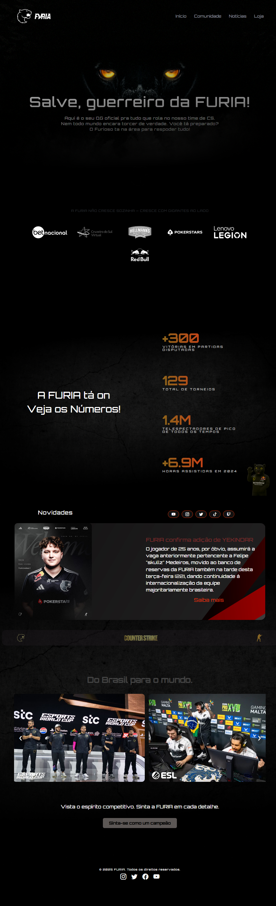
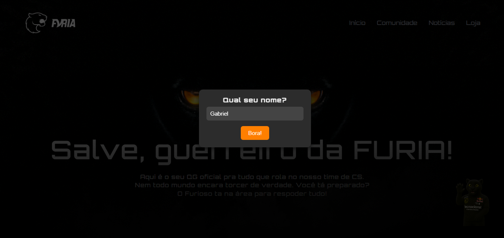
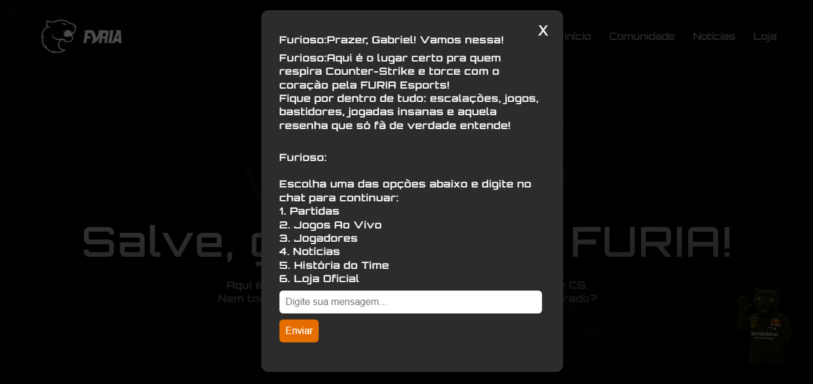
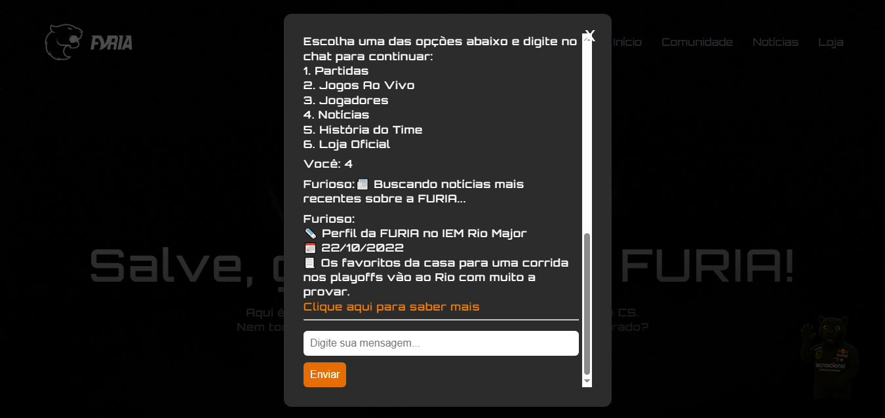
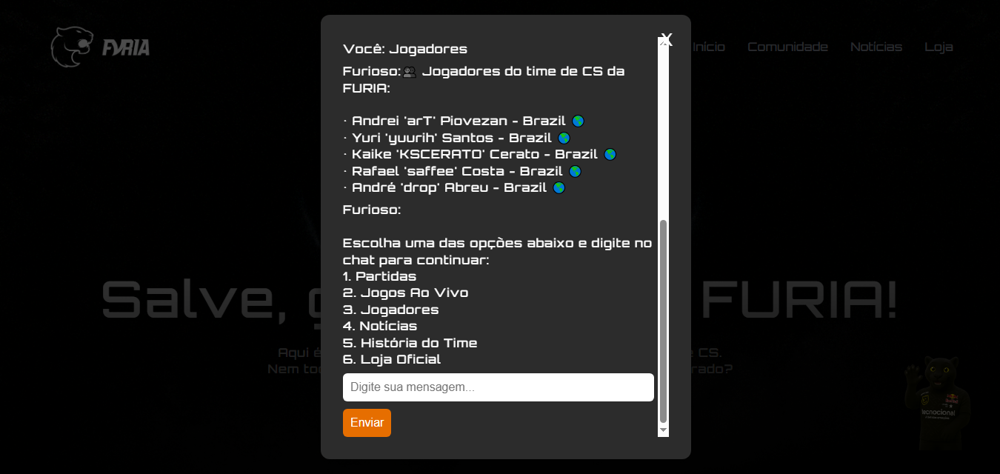

# Central FURIA CS

**Central FURIA CS** é uma **landing page imersiva** dedicada ao time de Counter-Strike da **FURIA Esports**, oferecendo uma experiência interativa e informativa para fãs e entusiastas do cenário competitivo. O projeto conta com um **chatbot integrado** que interage com os usuários e fornece dados atualizados por meio da **API da HLTV**, referência mundial em estatísticas de CS:GO e CS2.

## 🔥 Funcionalidades

- Interface visual moderna e temática da FURIA.
- Coleta e exibição de dados ao vivo via API da HLTV.
- Chatbot interativo com sugestões inteligentes e respostas em tempo real.
- Informações sobre jogadores, partidas, jogos ao vivo, história do time e loja oficial.

## 🛠️ Tecnologias Utilizadas

| Camada        | Tecnologias           |
|---------------|------------------------|
| **Front-end** | HTML5, CSS3, JavaScript |
| **Back-end**  | Node.js, Express.js     |
| **API**       | HLTV API (não oficial)  |
| **Deploy**    | Railway                 |

---

## 📁 Estrutura de Pastas

```
central-furia-cs/
├── assets/
│   ├── css/
│   │   ├── global.css       # Estilos globais reutilizáveis (resets, fontes, layout base)
│   │   ├── style.css        # Estilos específicos da landing page (cores, seções, botões)
│   │   └── chat.css         # Estilos dedicados ao componente de chat
│   ├── images/              # Imagens utilizadas na página (logos, banners, ícones)
│   └── js/
│       ├── main.js          # Scripts gerais da página (interações principais)
│       └── chat.js          # Lógica do chatbot (respostas, integração com API)
├── node_modules/            # Pacotes e dependências instalados via npm
├── index.html               # Arquivo principal HTML da landing page
├── package.json             # Configuração do projeto Node.js (scripts, dependências, rota de start para Railway)
└── server.js                # Servidor Node.js com Express que gerencia requisições e integrações externas
```

## 🧠 Chatbot FURIOSO

O personagem do chat é o **FURIOSO**, um bot carismático e temático da FURIA Esports, pronto para guiar os visitantes com agilidade e personalidade.

### 🔓 Identificação Inteligente
Ao ser clicado pela primeira vez, o **FURIOSO** solicita que você digite seu **nome**. Esse nome é armazenado localmente, permitindo que você **não precise digitá-lo novamente** em visitas futuras, mesmo após fechar e reabrir o chat.

### 📋 Menu de Interações
Após a identificação, o FURIOSO exibe a seguinte mensagem com opções para explorar:

## 💬 Exemplos de Interações com o Chatbot FURIOSO

A seguir, confira as respostas que o FURIOSO exibe para cada uma das opções do menu:

---

### 1️⃣ **Partidas**
### 2️⃣ **Jogos Ao Vivo**
### 3️⃣ **Jogadores**
### 4️⃣ **Notícias**
### 5️⃣ **História do Time**
### 6️⃣ **Loja Oficial**

## 🖼️ Abaixo, a Imagem da Landing Page e do Chatbot em Funcionamento

A seguir, você verá a imagem da **landing page** da Central FURIA CS, com o **chatbot FURIOSO** em funcionamento. O chatbot foi projetado para proporcionar uma interação dinâmica e inteligente com os usuários, oferecendo respostas em tempo real, enquanto consome dados da **HLTV API**, uma fonte confiável e mundialmente reconhecida para estatísticas de **CS:GO** e **CS2**.

<p align="center">
  
  
  
  
  
</p>


---

## 🌐 Link da Página

🔗 [Acesse a Landing Page da Central FURIA CS](https://central-furia-cs-production.up.railway.app/)

---

## 🙏 Agradecimentos

Gostaria de deixar um **agradecimento especial** a todo o time da **FURIA Esports**, especialmente à equipe de **Counter-Strike**, por toda a inspiração e dedicação que motivaram este projeto.

O trabalho de vocês dentro e fora dos servidores representa o espírito de superação, garra e estratégia — pilares que guiaram o desenvolvimento desta landing page.

---

## 🔗 Links Úteis

- 🌐 Site oficial da FURIA: [https://www.furia.gg/](https://www.furia.gg/)  
- 📊 API utilizada (HLTV não oficial): [https://hltv-api.vercel.app/](https://hltv-api.vercel.app/)

---

## 👨‍💻 Sobre o Desenvolvedor

Este projeto foi desenvolvido por **Gabriel Azevedo**, apaixonado por tecnologia, e-Sports e desenvolvimento web.

💼 Estou **aberto a novas oportunidades** e desafios que envolvam criatividade, dados em tempo real, APIs e experiências digitais inovadoras.  

---

### 💛 Muito obrigado, FURIA, pelo desafio e pela chance de transformar paixão em código!


